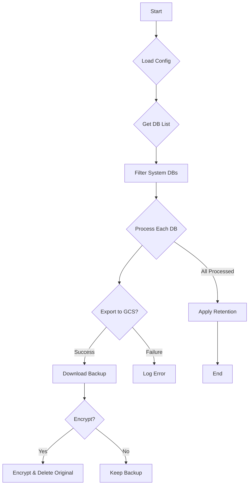

# GCP Cloud SQL Backup Manager

Automated backup solution for Google Cloud SQL with encryption and retention policies.

## Features
- Automated Cloud SQL database exports to GCS
- Optional AES-256 encryption using GPG
- Configurable local retention policy
- System databases exclusion
- Detailed logging system
- External configuration file support

## Workflow

## Prerequisites
- Google Cloud SDK (gcloud, gsutil)
- GPG (for encryption)
- IAM Permissions:
    cloudsql.instances.export
    storage.objects.create
    storage.objects.get

## Configuration
Create /etc/gcp_backup.conf:

    # Required
    CLOUD_SQL_INSTANCE="your-instance"
    GCS_EXPORT_BUCKET="your-bucket"
    BACKUP_DIR="/backups/sql"

    # Optional
    ENCRYPTION_PASSPHRASE=""
    EXCLUDE_DATABASES="information_schema mysql"
    RETENTION_DAYS=30

Set permissions:
    chmod 600 /etc/gcp_backup.conf
    mkdir -p $BACKUP_DIR
    chmod 700 $BACKUP_DIR

## Usage
Basic execution:
    sudo ./gcp_sql_backup_manager.sh

Crontab example:
    0 2 * * * /path/to/script.sh

## Logging
Log format:
    [YYYY-MM-DD HH:MM:SS] [level] message

Sample entries:
    [2023-10-15 09:30:45] [info] DB: orders - Export started
    [2023-10-15 09:32:10] [success] Backup encrypted: orders_20231015.bak.aes256

## Retention Policy
Key points:
- Deletes files older than RETENTION_DAYS
- Applies to local backups only
- Runs after main backup process

## Security
Important notes:
    - Encryption uses AES-256
    - Config file must have 600 permissions
    - Use service accounts with minimal privileges

## Troubleshooting
Common checks:
1. Verify GCS bucket permissions
2. Check Cloud SQL instance access
3. Monitor disk space in BACKUP_DIR

Debug command:
    sudo bash -x gcp_sql_backup_manager.sh

---
License: MIT | Version: 1.0.0 | Tested on: Ubuntu 22.04
